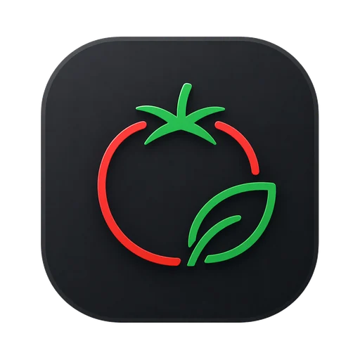
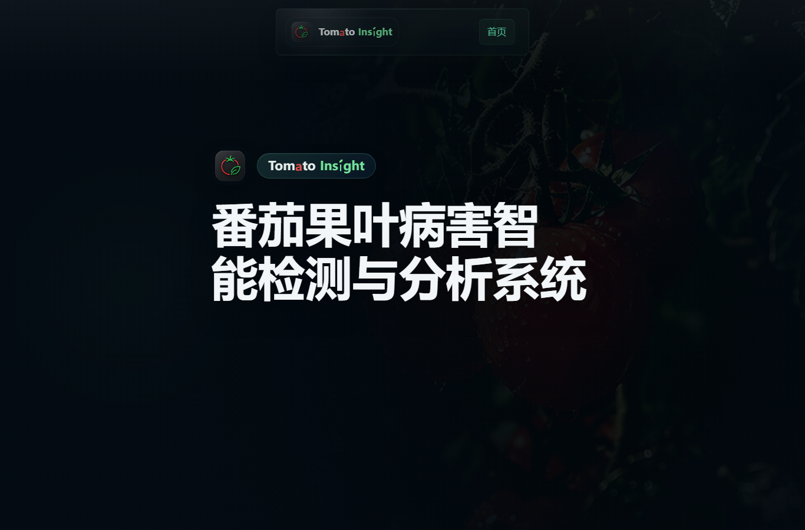
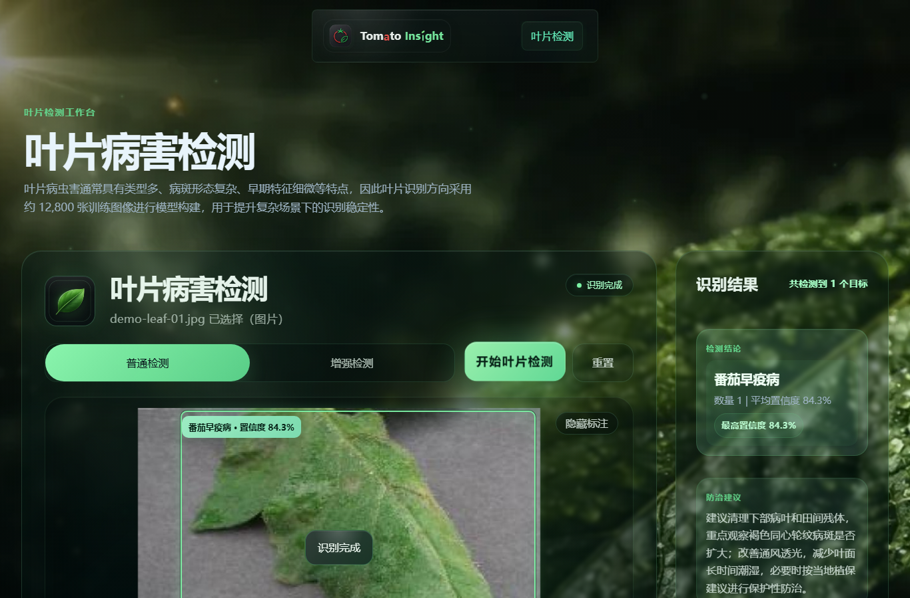
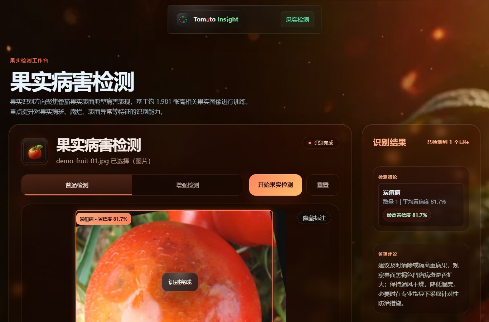
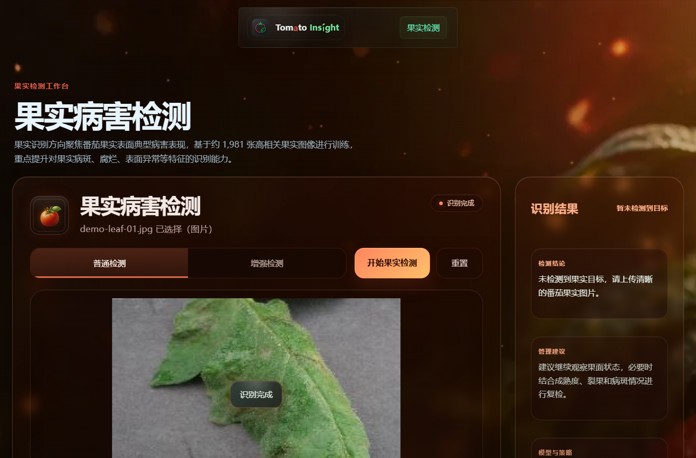
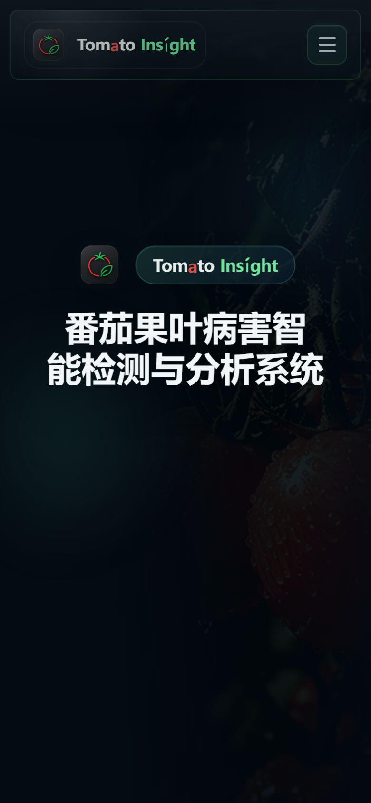
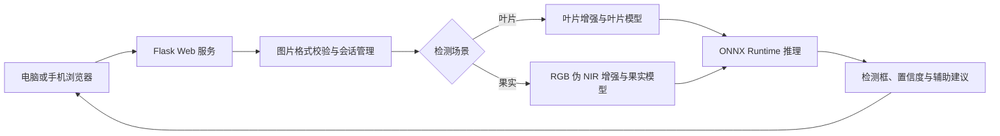

<div align="center">
  

# Tomato Insight

**番茄果叶病害智能检测与分析系统**

[](https://www.python.org/)
[](https://flask.palletsprojects.com/)
[](https://onnxruntime.ai/)
[](https://git-lfs.com/)
[](https://github.com/Liang-07-wen/tomato-insight/actions/workflows/quality-check.yml)

[](https://render.com/deploy?repo=https://github.com/Liang-07-wen/tomato-insight)

[界面预览](#页面展示) · [Render 部署](#render-部署) · [Docker 部署](#docker-部署) · [接口说明](docs/API.md) · [版本记录](CHANGELOG.md)
</div>

## 项目简介

Tomato Insight 面向智慧农业中的番茄病害识别与辅助分析场景，基于 YOLO26 构建叶片与果实双模型检测框架。系统通过 Flask 提供 Web 服务，使用 ONNX Runtime 完成模型推理，支持图片上传、格式校验、目标检测、检测框标注、置信度展示、辅助建议和历史记录回看。

系统设置普通检测与增强检测两种模式：

- **叶片检测**：采用 SE 清晰度增强，辅助突出病斑边缘与纹理细节。
- **果实检测**：采用基于 RGB 的伪 NIR 增强，辅助强化果面颜色层次与异常区域表现。

> RGB 伪 NIR 是基于可见光图像构建的增强表达，不代表真实近红外传感器或独立 NIR 波段采集。

## 项目页面

- 首页：`/`
- 叶片检测：`/leaf`
- 果实检测：`/fruit`
- 项目介绍：`/about`
- 关于我们：`/developer`

项目提供完整的本地运行与 Docker 部署能力。部署到支持 Docker 的云平台后，可直接通过浏览器使用叶片与果实检测功能。

## 页面展示

### 首页



### 叶片检测



### 果实检测



### 跨场景无目标提示



<details>
<summary>查看移动端首页</summary>



</details>

## 核心功能

- 叶片与果实双模型分场景识别。
- 普通检测与增强检测模式切换。
- JPG、JPEG、PNG、WEBP 图片上传与前端预览。
- 检测类别、置信度、检测框和标注结果图展示。
- 病害或异常目标辅助分析建议。
- 基于会话的上传、结果和历史记录管理。
- 对不支持格式、重复提交和过期请求进行前后端控制。
- 电脑端与手机端响应式访问。

## 检测类别

### 叶片模型：10 类

番茄细菌性斑点病、番茄早疫病、番茄晚疫病、番茄叶霉病、番茄斑枯病、番茄二斑叶螨危害、番茄靶斑病、番茄黄化曲叶病毒病、健康叶片、番茄花叶病毒病。

### 果实模型：13 类

炭疽病、脐腐病、畸形果、裂果、健康番茄、晚疫病、霉变、斑萎病毒病、蒂腐病、日灼病、虫害、金色斑驳、着色不均。

## 系统架构



## 技术栈

| 模块 | 技术 |
|---|---|
| 后端 | Python、Flask、Gunicorn |
| 模型推理 | YOLO26、ONNX、ONNX Runtime |
| 图像处理 | Pillow、OpenCV、NumPy |
| 前端 | HTML、CSS、JavaScript |
| 部署 | Gunicorn、Docker、Render |
| 模型管理 | Git LFS |

## 项目结构

```text
tomato-insight/
├─ app.py                     # Flask 应用与检测接口
├─ yolo26_detector.py         # ONNX 模型加载与推理
├─ requirements.txt           # 兼容版本依赖
├─ requirements-lock.txt      # 本地验收环境的固定版本
├─ Dockerfile                 # Docker 与云平台运行镜像
├─ render.yaml                # Render Blueprint 配置
├─ .dockerignore              # Docker 构建排除规则
├─ models/
│  ├─ leaf/                   # 叶片模型与类别配置
│  └─ fruit/                  # 果实模型与类别配置
├─ templates/                 # Flask 页面模板
├─ static/
│  ├─ css/                    # 页面样式
│  ├─ js/                     # 页面交互
│  ├─ assets/                 # Logo 等品牌资源
│  ├─ images/                 # 页面图片
│  ├─ demos/                  # 演示样例
│  ├─ uploads/                # 运行时上传目录
│  └─ results/                # 运行时结果目录
├─ scripts/                   # 部署辅助脚本
└─ docs/                      # 接口、Render 部署文档与仓库截图
```

## 本地运行

### 1. 准备环境

- Python 3.10 或 3.11
- Git
- Git LFS

### 2. 克隆项目与下载模型

```powershell
git lfs install
git clone https://github.com/Liang-07-wen/tomato-insight.git
cd tomato-insight
git lfs pull
```

确认以下模型已完整下载：

```text
models/leaf/best.onnx
models/fruit/best.onnx
```

### 3. 创建虚拟环境

Windows PowerShell：

```powershell
py -3.11 -m venv .venv
.\.venv\Scripts\Activate.ps1
```

Linux：

```bash
python3 -m venv .venv
source .venv/bin/activate
```

### 4. 安装依赖

安装兼容版本：

```powershell
python -m pip install --upgrade pip
pip install -r requirements.txt
```

需要复现本地验收环境时：

```powershell
pip install -r requirements-lock.txt
```

### 5. 启动网站

```powershell
python app.py
```

程序会从端口 `5000` 开始选择可用端口，并在终端打印实际访问地址，例如：

```text
http://127.0.0.1:5000/
```

## Docker 部署

构建镜像：

```bash
docker build -t tomato-insight .
```

启动容器：

```bash
docker run --rm -p 7860:7860 tomato-insight
```

浏览器访问：

```text
http://127.0.0.1:7860/
```

容器使用 Gunicorn 启动 Flask 应用，并以普通用户身份运行。上传图片、检测结果和历史记录保存在容器临时文件系统中，容器删除或云端实例重启后会重新开始。

## Render 部署

项目已提供 `render.yaml` 和支持动态端口的 Dockerfile，可直接通过 GitHub 仓库部署：

[](https://render.com/deploy?repo=https://github.com/Liang-07-wen/tomato-insight)

部署时建议使用以下配置：

- Runtime：Docker
- Branch：`main`
- Region：Singapore
- Plan：Free
- Health Check Path：`/`

Render 会自动构建镜像，并通过环境变量 `PORT` 指定网站监听端口。详细步骤参见 [`docs/RENDER.md`](docs/RENDER.md)。

> Render 免费服务长时间没有访问时会休眠，首次重新访问需要等待唤醒；实例文件系统属于临时存储，重新部署后上传图片、检测结果和历史记录可能重置。

## 其他部署方式

仓库仍保留 Hugging Face Docker Space 的配置和部署脚本，详细步骤参见 [`docs/HUGGINGFACE_SPACES.md`](docs/HUGGINGFACE_SPACES.md)。

## 模型配置

| 模型 | 文件 | 类别数 | 输入尺寸 | 置信度阈值 |
|---|---|---:|---:|---:|
| 叶片 | `models/leaf/best.onnx` | 10 | 640 | 0.5 |
| 果实 | `models/fruit/best.onnx` | 13 | 640 | 0.6 |

两个 ONNX 模型通过 Git LFS 管理。下载 ZIP 时可能只得到 LFS 指针文件，推荐使用 `git clone` 和 `git lfs pull` 获取完整模型。

## API

系统核心接口为：

```text
POST /detect
GET /session
GET /history
DELETE /history
```

请求字段、响应结构和调用示例参见 [`docs/API.md`](docs/API.md)。

## 数据与隐私

- `static/uploads/` 和 `static/results/` 中的运行数据不会提交到 Git。
- `detect_history.json` 属于运行时历史数据，不包含在公开仓库中。
- 仓库只保留目录所需的 `.gitkeep` 文件。

## 项目状态

- 五个主要页面已完成。
- 叶片与果实图片检测链路已完成。
- 视频检测功能已移除。
- 支持 JPG、JPEG、PNG、WEBP 图片。
- 已完成本地功能验收、Docker 与 Render 部署配置，以及桌面端、移动端页面适配。

## 使用说明

本仓库当前用于项目展示、比赛评审、学习与技术交流，尚未附加独立开源许可证。模型识别结果用于辅助分析，不替代专业农业技术人员的现场判断。
